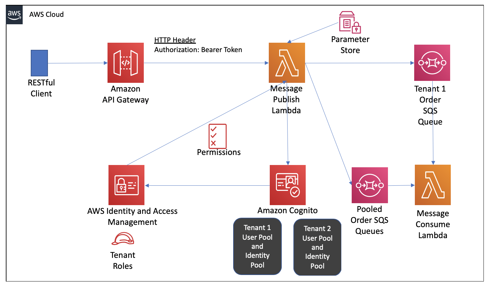
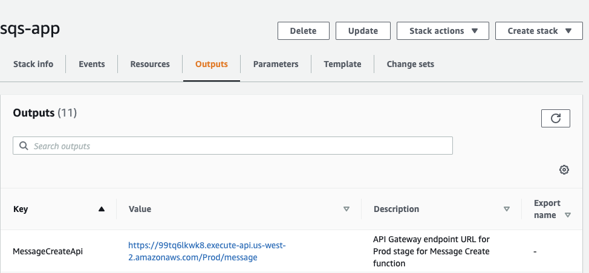
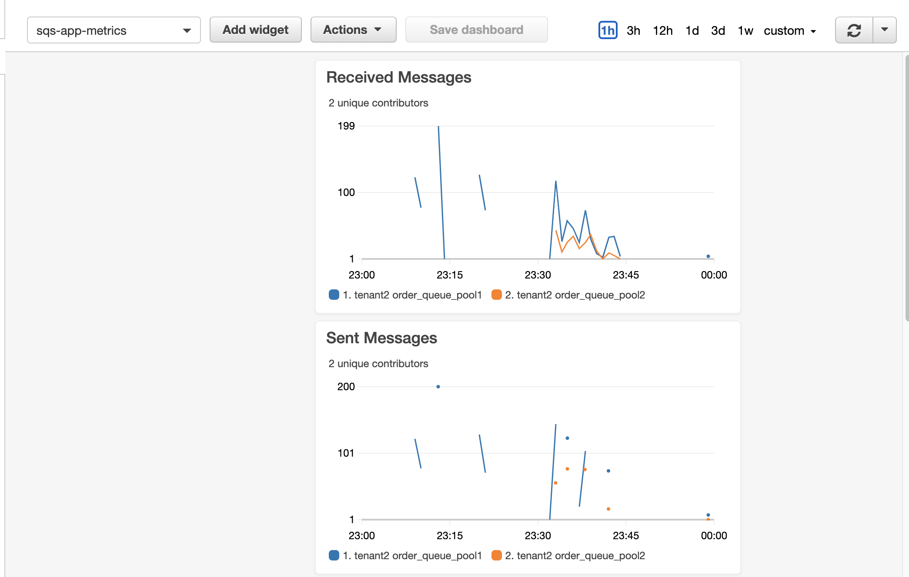

## Introduction
Using Amazon SQS in a multi-tenant Software as a Service (SaaS) solution means you need to design for noisy neighbors (or tenants saturating a queue) and you want to maintain tenant data isolation. In this sample, produced by the AWS SaaS Factory, we show you one way to implement Amazon SQS for a multi-tenant applicaiton.

This sample solution goes with the blog at at AWS [Using Amazon SQS in a Multi-tenant Solution](aws.amazon.com/blogblah).

## Prerequisites
This sample is written in Python and you will need following installed on your test host.
- Python 3.7 [Python 3](https://www.python.org/downloads/release/python-377/)
- pip3
- virtualenv  (pip3 install virtualenv) 
- git client
- jq version 1.6 or higher
- docker [Docker](), Optional if you want to use container for SAM to build the application.
- AWS Command Line Interface (AWS CLI) [AWS CLI (Command Line Interface) version 2](https://docs.aws.amazon.com/cli/latest/userguide/install-cliv2.html)
- AWS Serverless Application Model (AWS SAM) CLI version 1.1 or higher [AWS SAM CLI](https://docs.aws.amazon.com/serverless-application-model/latest/developerguide/serverless-sam-cli-install.html)
- ab (Apache Benchmark) [Download Apache Server with ab program](https://httpd.apache.org/docs/2.4/platform/) 

The solution can only be deployed in a AWS Region that has Cognito. You will need an AWS account that you have administrative access to in order to run the CloudFormation templates.

(Double-tcheck if this is true) This sample creates resources in your account that are not included in the AWS free tier. Please clean up these resources after experimenting to minimize costs.

## Architecture
In this solution, you will see how silo and pool model work for Amazon SQS. You will deploy a RESTful service using Lambda with Python, API Gateway, Cognito, IAM roles, and Amazon SQS using the AWS Serverless Application Model (SAM).

There is a SAM script to provision resources for two tenants.  Tenant 1 will have their own SQS queue to represent a silo model.  Tenant 2 will share SQS queues, representing a pool model.  Each tenant will have their own Amazon Cognito User Pool and Identity Pool.  An IAM role is setup per tenant with a policy to access the appropriate Amazon SQS. The role is associated to a Cognito Identity Pool for authenticated users.  A Python script will be used to create Cognito users for each tenant.

Once a tenant is provisioned and a user is created, a login is made into Cognito and a JSON Web Token (JWT) is returned with the tenant context inside. This JWT is used in a RESTful call to a Lambda function representing the service. In the Lambda function, the JWT is verified and a session is established to assume the role associated to the tenant. That session is used to publish a message to the SQS specific to the tenant.  The policies on the role enforce that messages only go to the allowed queue(s). This prevents a developer from accidentally publishing a message to the wrong queue in the code. 

For the pool model, where there are two queues for scalability, the message is published to the queue with th fewest messages in it. This is to show how you can reduce a noisy neighbor problem. The messages have a TenantID attribute to pass the context downstream to the consumer services. 

For sake of simplicity in deployment and running this hands-on solution, the consumers are Lambda functions written in Python that use the AWS SDK to consume messages from Amazon SQS.  It is common for the consumers to use the Tenant Id from the message attribute and process the message in the context of the tenant.


## Getting Started
1. Clone the repository from Github.
    ```shell
        git clone https://github.com/aws-samples/aws-saas-factory-sqs-multi-tenancy.git aws-saas-factory-sqs-multi-tenancy
        cd aws-saas-factory-sqs-multi-tenancy
    ```
2. Setup virtualenv
    ```shell
        #Install virtualenv
        pip3 install virtualenv
    
        #create the virtualenv
    
        virtualenv -p python3 env
    
        #activate the virtualenv
        source env/bin/activate
    
        #Install the required packages python packages
        pip3 install -r lambdas/requirements.txt
    ```

3. Use AWS SAM CLI to build and deploy the solution to your AWS account. 
    ```shell
        #Build the solution
        sam build
    
        #Deploy the solution with sam deploy.
        #Use defaults for everything by hitting return EXCEPT:
        #For Stack Name, enter sqs-app.
        #For Region, enter the AWS region you want to deploy to
        #For MessagePublishFunction may not have authorization defined, enter y
        #For Capabiltiies, use CAPABILITY_NAMED_IAM
    
    
        #Stack Name [sam-app]: sqs-app 
        #AWS Region [us-east-1]: 
        #Parameter Environment [dev]: 
        #Parameter DashboardPeriod [60]: 
        ##Shows you resources changes to be deployed and require a 'Y' to initiate deploy
        #Confirm changes before deploy [y/N]: n
        ##SAM needs permission to be able to create roles to connect to the resources in your template
        #Allow SAM CLI IAM role creation [Y/n]: n
        #Capabilities [['CAPABILITY_IAM']]: CAPABILITY_NAMED_IAM 
        #MessagePublishFunction may not have authorization defined, Is this okay? [y/N]: y
        #Save arguments to samconfig.toml [Y/n]: y
    
        sam deploy --guided 
    ```

The template will take a couple of minutes to finish deploying.

So what  has been deployed by SAM?  Here is the deployed architecture.
Here is a high-level diagram of the architecture for the hands-on solution.

<p align="center"></p>

A number of resources were created in your account including:
- An API Gateway
- A Lambda Function
- A IAM Role for execution by Lambda function
- 3 Amazon SQS Queues
- 3 AWS Systems Manager (SSM) Parameter store enries for the configured SQS queues to link to a tenant
- Cloudwatch Dashboard for metrics on messages by tenant
- 2 Cognito User Pools
- 2 Cognito Identity Pools
- 2 IAM Roles, one per tenant

## See it in action
When the SAM stack is completely finished, the sample environment is ready for you to experiment with. First, you need the endpoint URL for the API Gateway. You can get this from the outputs of the "sam deploy" command stack, from the stack outputs on Cloudformation, or you can go to the API Gateway console.

The URL will look like:  https://99tq6lkwk8.execute-api.us-west-2.amazonaws.com/Prod/message. Here is the output of the MessageCreateApi in the Cloudformation console for my stack named "sqs-app":

<p align="center"></p>

Create a shell variable with the DNS Name for the API Gateway URL to make the commands easier to execute.

    #If your AWS Region is different then the default in your profile, set default region
    export AWS_DEFAULT_REGION=us-east-1

    #get the API url
    API=`aws cloudformation describe-stacks --stack-name sqs-app --query "Stacks[0].Outputs[?OutputKey=='MessageCreateApi'].OutputValue" --region us-east-1 --output text`

    #verify API env var is set
    echo $API

    # Make sure we can talk to the API and the service
    curl -w "\n" $API
    # this should return {"message":"Missing Authentication Token"}

    # Let's create a Cognito user for Tenant 1 
    cd resources

    #create user for Tenant1
    python3 user.py Tenant1 N

    # Let's create a Cognito user for Tenant 2
    python3 user.py Tenant2 N
 
Grab the JWT TOKEN for Tenant 1 and send a message

    #get JWT token from Cognito
    TOKEN1=`python3 user.py Tenant1 Y |  jq -r '.token'`
    echo $TOKEN1

    #execute the CURL command to send a message using the API and Lambda
    curl -d '{"message":"my test body tenant 1"}' \
    -H "Content-Type: application/json" \
    -X POST \
    -H "Authorization: Bearer ${TOKEN1}" $API

    #the command should return with a JSON with message:  "message sent to queue"
    ```
Let's repeat for Tenant2.  Grab the JWT TOKEN for Tenant 2 and send message

    #get JWT token from Cognito
    TOKEN2=`python3 user.py Tenant2 Y |  jq -r '.token'`
    echo $TOKEN2

    #execute the CURL command to send a message using the API and Lambda
    curl -d '{"message":"my test body tenant 2"}' \
    -H "Content-Type: application/json" \
    -X POST \
    -H "Authorization: Bearer ${TOKEN2}" $API

    #the command should return with a JSON with message:  "message sent to queue"

## Let's generate some random messages with TOKEN2 using the Apache Bench

1. Update the message in the resources/message.txt JSON file 
    ```json
    {"message":"my test body tenant 2"}
    ```
2. Run the ab command after you have setup the TOKEN and API from above,  -c is the concurrent clients and -n is the number of requests to run in the test.
    ```shell
    #-p means to POST it
    #-H adds an Auth header (could be Basic or Token)
    #-T sets the Content-Type
    #-c is concurrent clients
    #-n is the number of requests to run in the test
    ab -p message.txt -T application/json -H "Authorization: Bearer $TOKEN2" -c 10 -n 500 $API
    ```


### Now we can go look at the metrics in the AWS CloudWatch console
1. Navigate to the AWS Cloudwatch Console in the region that you deployed the stack
2. Select the dashboard named sqs-app-metrics
3. You should see metrics like the number of message per tenant and per queue

<p align="center"></p>

## Time to clean up
SAM CLI executed CloudFormation to create the resources. I find it easiest to go in the AWS Console and delete the stack.
1. Go to AWS CloudFormation console-> select the "sqs-app" stack you created and delete it
1. It will take roughly 4 minutes to delete the stack.


## License
This library is licensed under the MIT-0 License. See the [LICENSE](./LICENSE) file.
